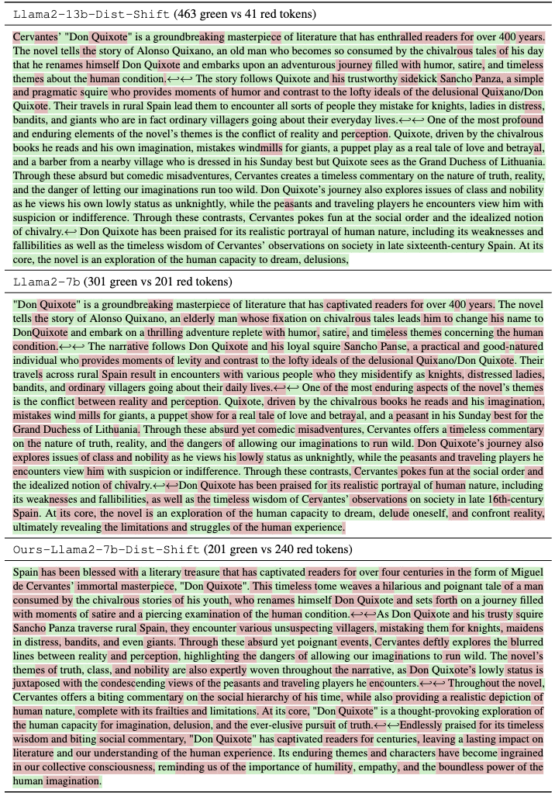
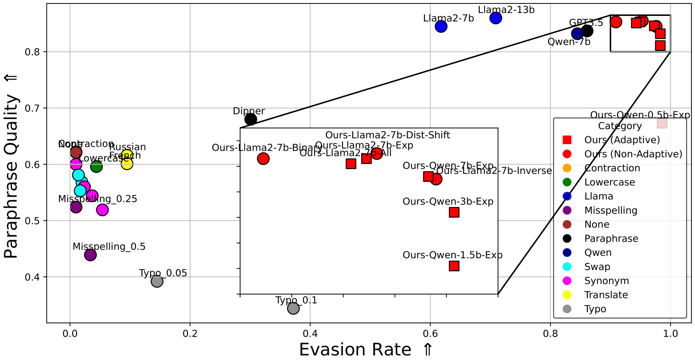
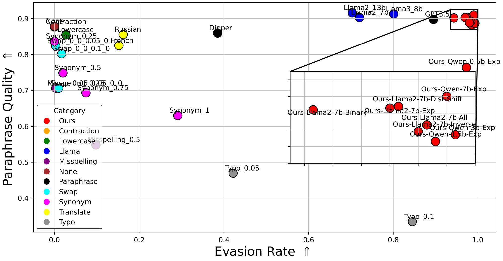
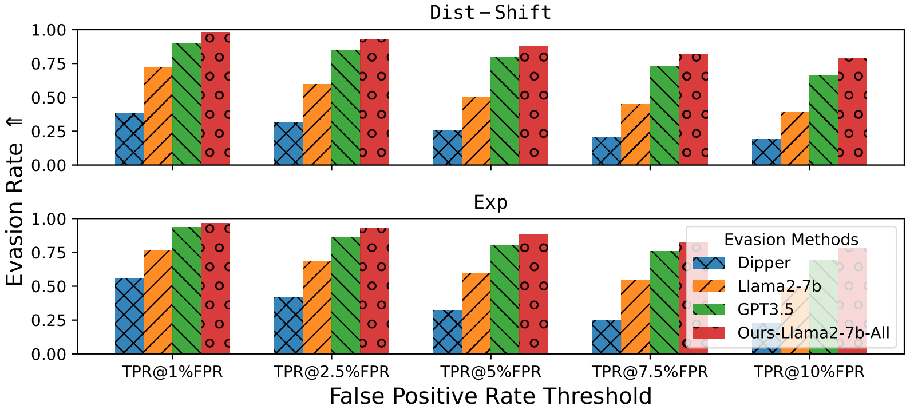
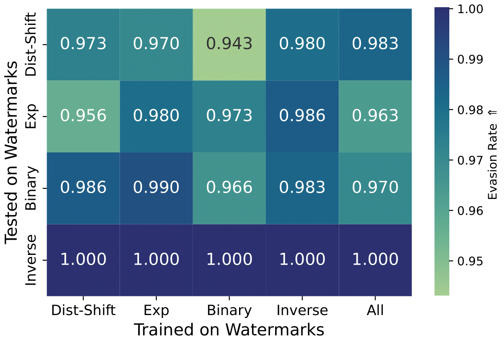
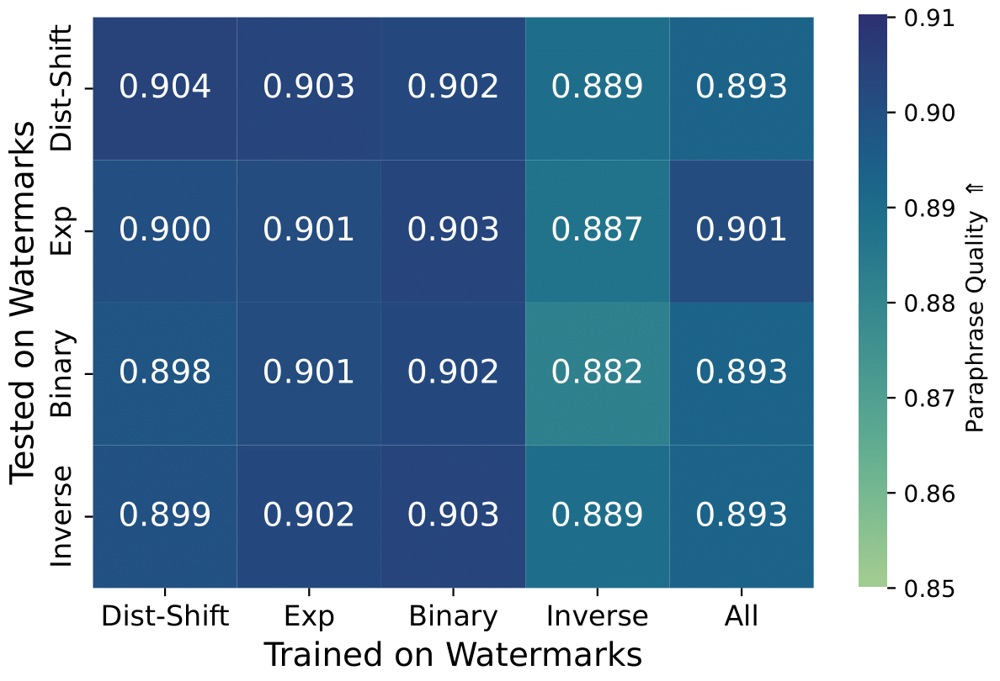

# Optimizing Adaptive Attacks Against Content Watermarks for Language Models

## Overview

This repository provides the implementation of our research work: **"Optimizing Adaptive Attacks Against Content Watermarks for Language Models"**. The goal is to evaluate and enhance the robustness of content watermarking methods used to distinguish machine-generated text from human-written text. Our approach leverages adaptive attacks to demonstrate vulnerabilities in existing watermarking methods.



## Key Highlights

- Adaptive attacks are designed to evade watermark detection while preserving text quality.
- Evaluation against state-of-the-art watermarking methods like Exp, Dist-Shift, Binary, and Inverse.
- Efficient implementation requiring less than 7 GPU hours to achieve high evasion rates (>96%).
- Robustness testing against both adaptive and non-adaptive settings.

## Features

- **Preference-Based Optimization**: Fine-tuning paraphrasers to adaptively evade detection.
- **Compatibility**: Tested with various open-weight models, such as Llama2, Llama3, and Qwen2.5.
- **Efficient Performance**: Practical optimization that requires minimal computational resources.
- **Extensibility**: Codebase built on top of [MarkLLM](https://github.com/THU-BPM/MarkLLM) which was designed for easy experimentation with new watermarking methods.

## Repository Contents

- `MarkLLM/`: Parent module for training and evaluation.
  - `src/`: Contains the main implementation files.
  - `MarkLLM/`: Core modules for training and evaluation.
- `examples/`: Demonstrative examples to get started.
- `experiments/`: Scripts and configurations for running our experiments.

```plaintext
MarkLLM/                        # Parent module for training and evaluation
├── config/                     # Configuration files for various watermark algorithms       
├── dataset/                    
│   └── markmywords/            # Dataset used for our study
├── evaluation/                 
│   ├── dataset.py              
│   ├── examples/               
│   │   └── assess_overall.py   # Factory for creating watermark robustness evaluation pipelines
│   ├── pipelines/              
│   │   ├── detection.py
│   │   ├── pipeline_stages.py  # i.e., from generation to detection
│   │   ├── quality_analysis.py   
│   │   └── robustness.py       # Pipeline for comprehensive watermark robustness evaluation
│   └── tools/                  # Evaluation tools
│       ├── oracle.py
│       ├── success_rate_calculator.py  
│       ├── text_editor.py       
│       └── text_quality_analyzer.py   
├── exceptions/                 
├── font/                       
├── MarkLLM_demo.ipynb          
├── visualize/                  # Visualization Solutions module of MarkLLM
├── scripts/                    # training and evaluating our adpative paraphrasers
│   ├── average_results.py    
│   ├── calculate_stats.py
│   ├── dpo_train.py    
│   ├── plots.py
│   ├── preprocess_dpo.py    
│   ├── runner.sh
│   ├── tables.py    
│   ├── token_frequency.py  
│   └── trainer_runner.sh   
├── test/                       # Test cases and examples for user testing
│   ├── test_method.py    
│   ├── test_pipeline.py  
│   └── test_visualize.py   
├── utils/                      # Helper classes and functions supporting various operations
│   ├── openai_utils.py   
│   ├── transformers_config.py 
│   └── utils.py          
├── visualize/                  # Visualization Solutions module of MarkLLM
├── watermark/                  # Implementation framework for watermark algorithms
│   ├── auto_watermark.py       # AutoWatermark class
│   ├── base.py                 # Base classes and functions for watermarking             
│   └── ...                     # Class implementation for major watermarks
├── README.md                   # Main project documentation
└── requirements.txt            # Dependencies required for the project
```

## Getting Started

### Prerequisites

- Python >= 3.9
- PyTorch >= 1.11
- Hugging Face Transformers Library

### Installation

Clone the repository and install the required dependencies:
```bash
# Clone the repository
git clone https://github.com/D-Diaa/MarkLLM.git
cd MarkLLM

# Install dependencies
pip install -r requirements.txt
```

### Running Experiments

To reproduce our main results:
1. Prepare the dataset using the preference dataset curation method.
2. Train the paraphraser with adaptive fine-tuning.
3. Evaluate on provided watermarking methods.

Run the following command:
```bash
<PLACEHOLDER> python src/train.py --config configs/adaptive_attack.yaml
```

## Evaluation

### Adaptive vs Non-Adaptive Performance
Our adaptive attacks outperform non-adaptive baselines in both evasion rates and paraphrase quality:

- **Evasion Rate:** >96% against all tested watermarking methods.
- **Paraphrase Quality:** Consistently high across metrics (e.g., LLM-Judge, PPL).

### Results and Visualization
- The evasion rate versus text quality trade-off of all surveyed attacks when the provider uses a Llama3-70b model and the Exp (Aaronson & Kirchner, 2023) watermark.
  
  
- The evasion rate versus text quality trade-off of all surveyed attacks when the provider uses a Llama2-13b model and the Dist-Shift/KGW (Kirchenbauer et. al, 2023) watermark.
  
  
- The evasion rates against a watermarked Llama2-13b model. We compare non-adaptive attacks, including ChatGPT3.5, versus our adaptively fine-tuned Llama2-7b paraphraser model.
  

- The evasion rates (Up) and text quality measured with LLM-Judge (Down). The attacker uses a matching Llama2-7b surrogate and paraphraser model versus the provider’s Llama2-13b. We evaluate both the adaptive (diagonals) and the non-adaptive case (values not on the diagonal). For example, we obtain the bottom left value by training against Dist-Shift and testing on Inverse.
  
  

## Citation

If you find this work useful, please cite:

```bibtex
@article{diaa2024optimizingadaptiveattackscontent,
      title={Optimizing Adaptive Attacks against Content Watermarks for Language Models}, 
      author={Abdulrahman Diaa and Toluwani Aremu and Nils Lukas},
      year={2024},
      eprint={2410.02440},
      archivePrefix={arXiv},
      primaryClass={cs.CR},
      url={https://arxiv.org/abs/2410.02440}, 
}
```

## Acknowledgements

Special thanks to the THU-BPM team for creating and opensourcing their toolkit for LLM Watermarking. Visit the [MarkLLM GitHub repository](https://github.com/THU-BPM/MarkLLM) for more details.

## Contact

For questions or inquiries, feel free to contact us via the issues page or the provided email address in the repository.

